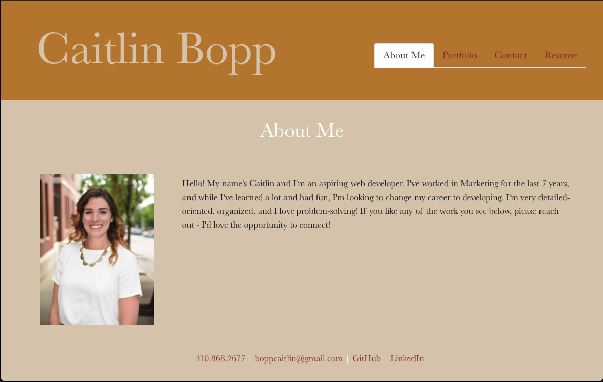

# React Portfolio

## Description
An overview of my portfolio, resume, and contact information in a single page React application.
## Table of Contents
- [Installation](#installation)
- [Usage](#usage)
- [License](#license)
- [Contributing](#contributing)
- [Questions](#questions)
## Installation
To install necessary dependencies, run the following command:
```
npm i
npm start
```

## Usage
A linked to my deployed portfolio can be found here: [React Portfolio](https://caitbopp.github.io/react-portfolio/).




## License
This project is licensed under the: none.


## Contributing
There were no additional contributors to this project.

## Questions
If you have any questions about the repo, open an issue or contact me directly at boppcaitlin@gmail.com. You can find more of my work at [caitbopp](https://github.com/caitbopp).